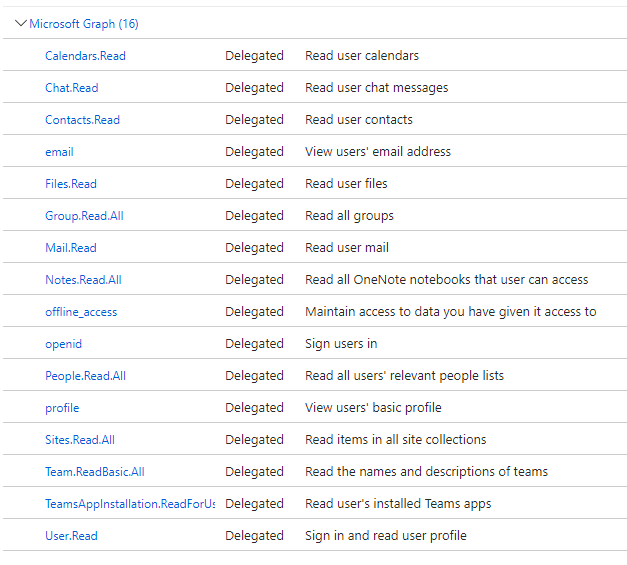

 # .NET MVC (Model - View - Controller) web app connected to Microsoft Graph

This is a template for .NET Core MVC (Model - View - Controller) web app that connects to Microsoft Graph.

# Introduction

**Application name** : Microsoft 365 Tiles

The application provides different Microsoft 365 tiles and charts based on the Microsofrt Graph API for the currently logged in user. Application has been built using .Net 7.0 MVC and with Microsoft Graph API SDK Version **4.2.0**

The application has the following main features

* > **Charts**
    1. Messages stats
    2. Chat stas
    3. Files stats
    4. Tasks stats
* > **Tiles**
    1. Recent documents
    2. Viewed and modified
    3. OneDrive items
    4. Notebooks
    5. Upcoming events
    6. Followed sites
    7. Contacts
    8. Colleagues around
    9. Recent tasks
    10. Joined Teams
    11. Teams stats

# Demo

# Screenshots

### Charts

### Tiles

## Minimal Path to Awesome 🚀

Follow the instructions to successfully run your MVC app with Microsoft Graph. 
### 1. Register an Azure Active Directory app
Please follow the below steps to register your app in Azure AD: 

* Go to [Azure Portal](https://portal.azure.com) and login with your testing account that has Application developer or administrator permissions.
* Select **Azure Active Directory**, and select **App Registrations** from the left side bar. Then select **+ New registration**.
* Give any name to your app. For **Supported account types**, select **Azure AD and Personal Accounts (Any Azure AD directory - Multitenant)**.
* Select **Overview** and make a note of **Application (Client) ID**, and **Directory (tenant) ID
* Select **Authentication** from the left navigation, and select **Add a platform**
* Select **Web** and enter https://localhost:7004/signin-oidc as Redirect URI (replace the port number with your local host port)
* Make sure **Access tokens (used for implicit flows)** and **ID tokens (used for implicit and hybrid flows)** are selected
* Select **Save**
* Navigate to **Certificates & secrets** and create a new client secret, make a note of the client secret
* Select **API permissions* and select **Add a permission**, then add the following delegated permissions:

### 2. Run the app

* Open the project folder `MyM365App` with the editor of your choice. (Visual Studio 2022 is recommended.)
* Open **appsettings.json** and update the following entries:
  * **Domain**: your full domain name (e.x. contoso.onmicrosoft.com)
  * **TenantId**: tenant Id
  * **ClientId**: the app client Id
  * **ClientSecret**: the client secret you created in previous steps
* In Visual Studio, press F5 to run the app.
* Login and enjoy!
