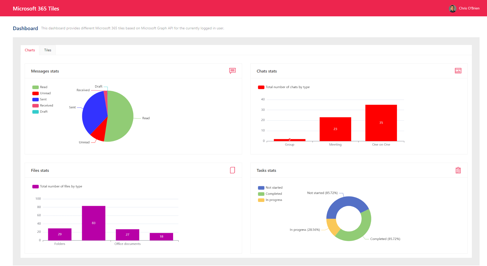
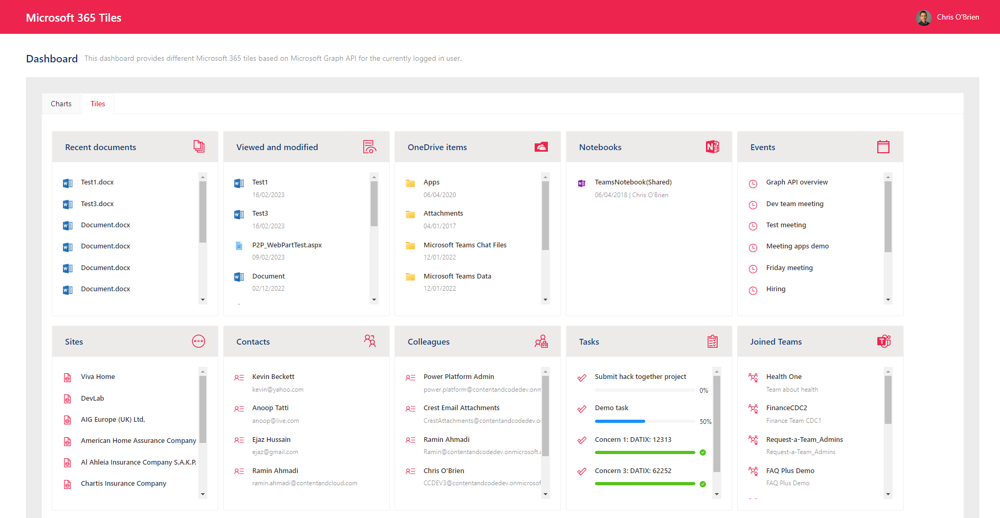

# .NET MVC (Model - View - Controller) web app connected to Microsoft Graph

This is a template for .NET Core MVC (Model - View - Controller) web app that connects to Microsoft Graph.

# Introduction

**Application name** : Microsoft 365 Tiles

The application provides different Microsoft 365 tiles and charts based on the Microsofrt Graph API for the currently logged in user. Application has been built using .Net 7.0 MVC and with Microsoft Graph API SDK Version **4.2.0**

The application has the following main features

* > **Charts**
    1. Messages stats
    2. Chat stas
    3. Files stats
    4. Tasks stats
* > **Tiles**
    1. Recent documents
    2. Viewed and modified
    3. OneDrive items
    4. Notebooks
    5. Upcoming events
    6. Followed sites
    7. Contacts
    8. Colleagues around
    9. Recent tasks
    10. Joined Teams
    11. Teams stats

# Screenshots

## Minimal Path to Awesome 🚀

It's coming soon.
